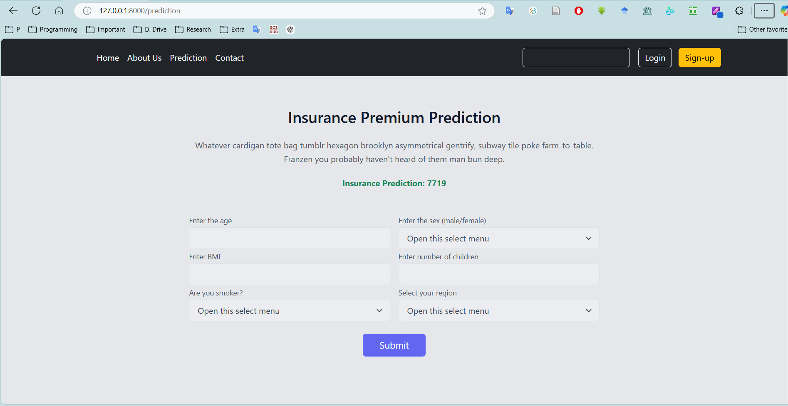

# Insurance Prediction Django Project

## Table of Contents

1. [Overview](#overview)
2. [Features](#features)
3. [Project Structure](#project-structure)
4. [Technologies Used](#technologies-used)
5. [Setup Instructions](#setup-instructions)
6. [Design Resources](#design-resources)

---

## Overview

The **Insurance Prediction Django Project** is a web application designed to predict insurance-related outcomes based on user-provided data. This project leverages Django as the backend framework, along with modern UI technologies like TailwindCSS and Bootstrap for an intuitive and responsive user interface.

---

## Features

- **Dynamic Forms**: User-friendly forms to input insurance-related data.
- **Prediction Engine**: A machine learning model integrated for real-time predictions.
- **Modern Design**: Responsive and visually appealing UI powered by TailwindCSS and Bootstrap.
- **Illustrations**: Engaging visuals using assets from [Undraw](https://undraw.co/).

---

## Project Structure

    The project is organized as follows:
    insurance_prediction_django_project/ 
    ├── .idea/ # IDE configurations (specific to your setup) 
    ├── home/ # Home app for main landing pages 
    ├── insurance/ # Core app for insurance prediction logic 
    ├── static/ # Static files (CSS, JS, Images, etc.) 
    ├── templates/ # HTML templates for rendering views 
    ├── db.sqlite3 # SQLite database 
    ├── manage.py # Django management script 
    ├── output.png # Project screenshot 
    ├── readme.md # Project README file


---

## Technologies Used

### **Backend**
- [Django](https://www.djangoproject.com/) - Python-based web framework for building scalable applications.

### **Frontend**
- [TailwindCSS](https://tailwindcss.com/docs/installation/play-cdn) - Utility-first CSS framework for rapid UI development.
- [Bootstrap](https://getbootstrap.com/) - CSS framework for responsive and elegant UI components.
- [Undraw Illustrations](https://undraw.co/) - Free, customizable illustrations for enhancing visual appeal.

---

## Setup Instructions

### Prerequisites
1. Install Python 3.8+.
2. Install `pip`, the Python package manager.
3. Set up a virtual environment (optional but recommended).

### Steps

1. **Clone the Repository**:
   ```bash
   git clone https://github.com/duetianmehedishuvo/insurance_prediction_django_project.git
   cd insurance_prediction_django_project
   
2. **Set up Virtual Environment:**:
   ```bash
    python -m venv venv
    source venv/bin/activate  # Linux/MacOS
    venv\Scripts\activate     # Windows

3. **Install Dependencies**:
    ```bash
    pip install -r requirements.txt

4. **Apply Migrations**:
    ```bash
    python manage.py makemigrations
    python manage.py migrate
   
5. **Run the Server**:
    ```bash
   Run the Development Server:

6. **Access the Application**:
   Visit `Open your browser and navigate to http://127.0.0.1:8000/.

## Design Resources
The UI design for this project utilizes the following resources:

## TailwindCSS:

## Documentation: TailwindCSS Play CDN
Used for creating utility-first and responsive designs.
Bootstrap:

## Documentation: Bootstrap Forms
Used for form styling and layout consistency.
Undraw Illustrations:

## Website: Undraw Banking
Used for free, customizable illustrations.

# Output

